#  🔐 Real-Time Web Permission Tracker

##  🧩 Problem Statement

Modern web applications often require access to sensitive user permissions such as 📍location, 🎥camera, and 🎙️microphone. However, users lack transparency and control over which permissions are being accessed in real-time, leading to 🛑 privacy concerns and potential misuse. There is a need for a system that can track, display, and manage web permissions in real-time, empowering users with better control and awareness.

##  💡 Approach and Solution

Our solution is a **Real-Time Web Permission Tracker** powered by a 🧩 Chrome Extension and a 📊 live web dashboard. It monitors and visualizes web permission usage events, providing users with full transparency and insight.

### ⚙️ How it Works:

-  🧩 **Chrome Extension Integration:** The extension detects permission-related API calls (e.g., `navigator.geolocation`, `getUserMedia`, `Notification.requestPermission`) as they happen. Every request, grant, or deny event is captured immediately.

- 📝 **Live Event Logging:** Captured events are sent to a backend server and recorded along with metadata like site origin, permission type, timestamp, and action taken.

-  📊 **Live Visualization:** A React dashboard displays a real-time feed and historical timeline of all permission events. Users can:
    - View which sites requested camera, mic, or location access.
    - See when and how often permissions were used.
 

-  🧠 **User Awareness Panel:**
      - From either the extension popup or the dashboard, users can quickly **whitelist** permissions for specific sites.
      - Users are also guided to browser settings for stricter permission blocks if needed.

-  🛡️ **Compliance-Ready Logging:** All permission consent events are persistently stored, making the system useful for auditing and data protection regulations like **GDPR**, which require logs of informed user consent.

## ✨ Features

-  🔍 **Real-Time Monitoring:** Instantly tracks and displays permission requests as they happen.
-  📊 **User Dashboard:** Centralized interface to view and analyze all web permissions.
-  📡 **Permission Awareness:** Understand which sites are using what permissions.
-  🔔 **Notifications:** Real-time alerts when sensitive permissions are accessed.
-  🕓 **History Logs:** View historical data of permission usage for auditing.
-  🔒 **Secure & Privacy-Focused:** All data is handled securely, prioritizing user privacy.

##  🛠️ Tech Stack

-  ⚛️ **Frontend:** React.js, Redux, Material-UI  
-  🖥️ **Backend:** Node.js, Express.js  
-  🗄️ **Database:** MongoDB  
-  🔐 **Authentication:** JWT (JSON Web Tokens)  
-  🧰 **Other Tools:** Webpack, Babel, ESLint

##  📸 Screenshots

-  🏠 **Home Screenshot**
  
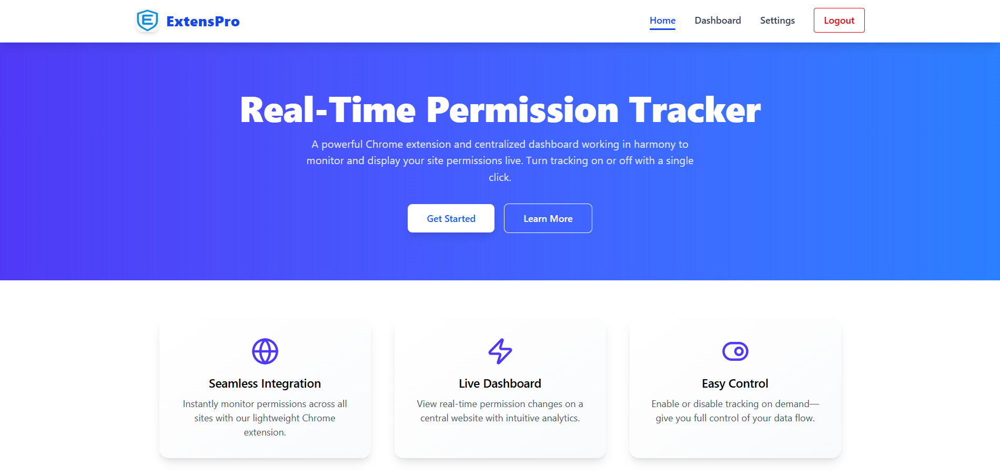
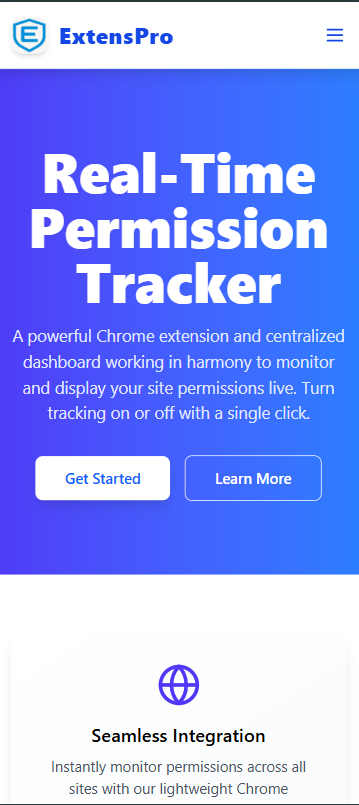
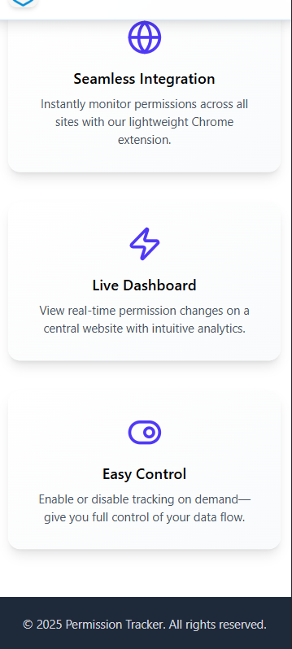

-  📊 **Dashboard Screenshot**
  
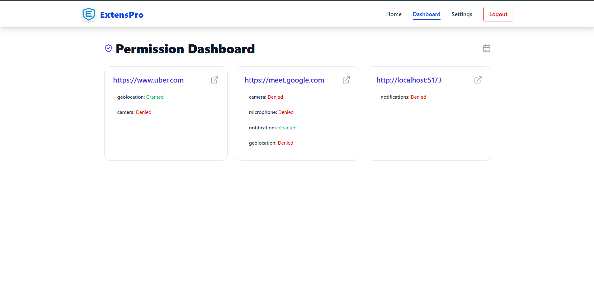
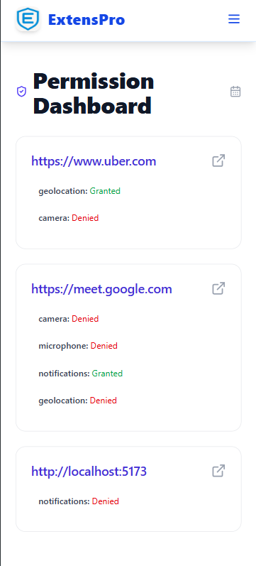
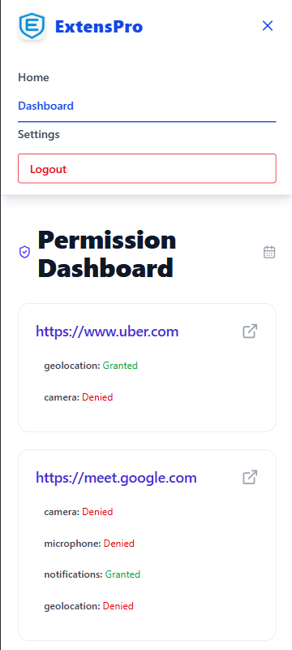

- ⚙️ **Setting Screenshot**
  
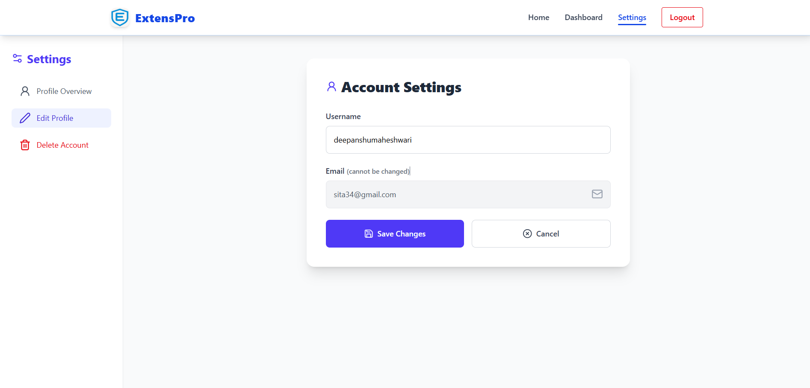
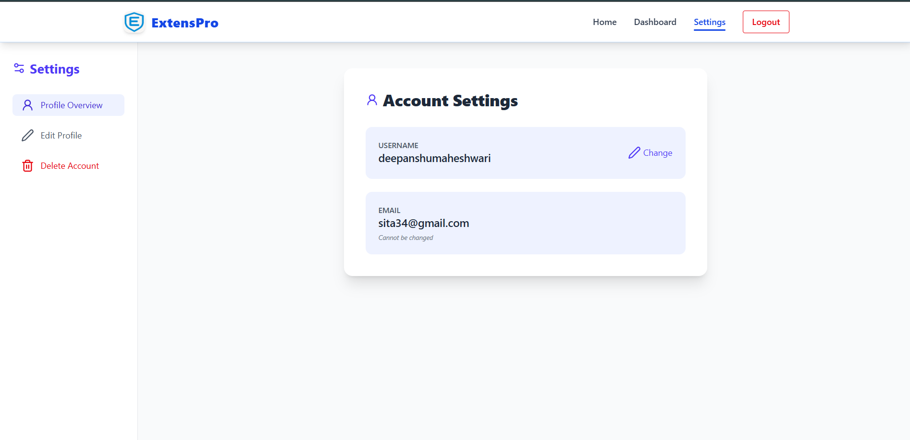
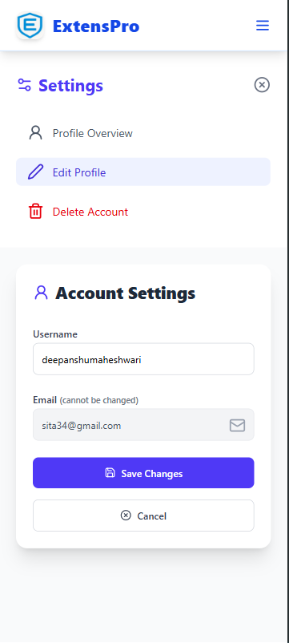
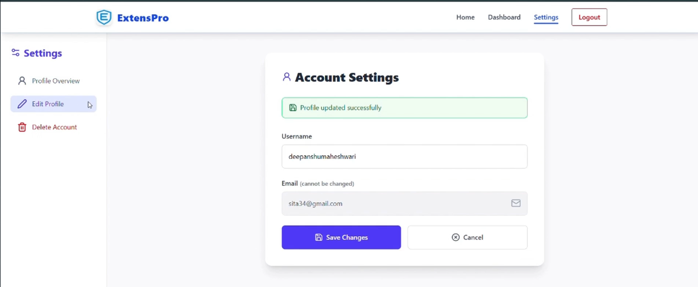

-  🔐 **Login Screenshot**
  
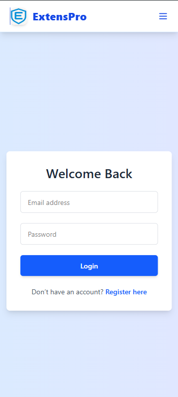

-  🧩 **Extension Screenshot**
  
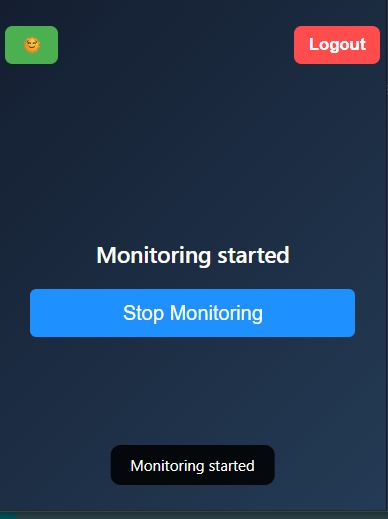

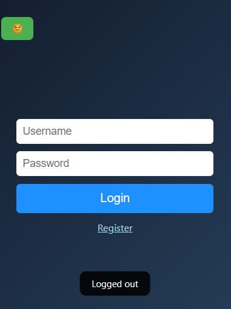


###  📦 Prerequisites

- 🟩 Node.js (v14+)
- 🚀 Express.js
- 📦 npm
- 🛢️ MongoDB

###  🧪 Installation and Configuration

1. **📥 Clone the repository**

   ```bash
   git clone https://github.com/jeetgoyal80/PrivacyGuard_chrome_extension
   cd chrome_extension


2. **📦 Install backend and frontend dependencies**

   ```bash
   cd backend
   npm install
   cd ../Extension
   npm install
   ```

3. **🔐 Create a `.env` file in the `Backend` directory** with the following variables:

   ```env
   PORT=8000
   MONGO_URI=your_mongodb_connection_string
   JWT_SECRET=your_jwt_secret
   CLIENT_ORIGINS=http://localhost:5173,chrome-extension://geoapkiniibiacdffdgcoodahoeoiafj
   ```

4. **🔐 Create a `.env` file in the `Extension` directory** with the following variables:

   ```env
   VITE_API_URL=http://localhost:8000/api
   VITE_WS_URL=http://localhost:8000
   ```

5. **🚀 Start the backend server**

   ```bash
   cd backend
   node index.js
   ```

6. **💻 Start the frontend development server**

   ```bash
   cd ../Extension
   npm run dev
   ```

7. **🌐 Access the application**

   Open your browser and navigate to: [http://localhost:5173](http://localhost:5173)


## 🛠️ Chrome Extension Installation Guide
** Prerequisites **
- Google Chrome (or any Chromium-based browser)

- Node.js (v14 or higher)

- npm (comes with Node.js)

** 📦 Building the Extension **
Navigate to the extension directory:

```bash
cd Extension
Install dependencies:
```

```bash
npm install
Build the production version:
```

```bash
npm run build
```
- This creates a dist folder with all the compiled extension files.

** 🧩 Loading the Extension in Chrome **
Open Chrome and go to:

- chrome://extensions/
Enable Developer Mode using the toggle in the top-right corner

- Click the "Load unpacked" button

- Select the dist folder generated in the previous step

- The extension icon should now appear in your Chrome toolbar

** 🔄 Updating the Extension **
When you make changes to the extension code:

Rebuild the extension:

```bash
npm run build
```
Go back to chrome://extensions/

Locate your extension and click the 🔄 Refresh button

## ⚠️ Troubleshooting Common Issues

If you encounter problems during installation or use, here are some common solutions:

| Issue                  | Solution                          |
|------------------------|-----------------------------------|
| Extension not loading  | Verify correct `dist` folder selection |
| Permission errors      | Check `.env` matches extension ID |
| Strange behavior       | Restart Chrome completely         |

Additional debugging tips:
- Open Chrome Developer Tools (Ctrl+Shift+J) to view error logs
- Ensure you're using the latest version of Chrome
- Check console output during `npm run build` for compilation errors
---

